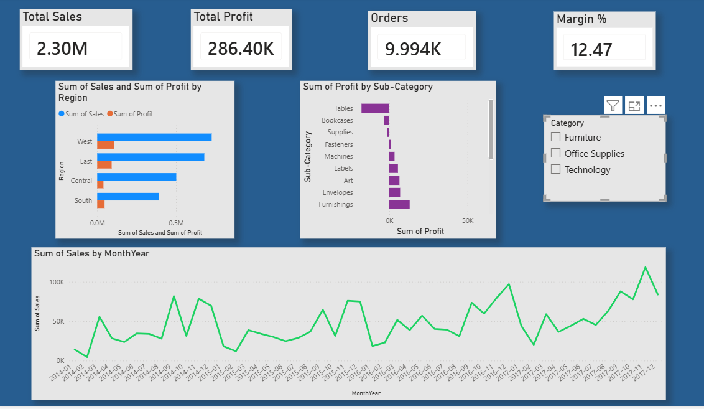

# Superstore Retail Performance Analysis

## Overview
End-to-end analysis of 9,994 retail orders to identify revenue drivers, 
profitability issues, and seasonal trends using SQL, Excel, and Power BI.

## Business Questions Answered
1. Which region generates the most revenue and profit?
2. Which product categories and sub-categories are loss-making?
3. Do higher discounts lead to lower profit?
4. Which customer segment is most valuable?
5. What seasonal trends exist in sales data?

## Key Findings
- West region leads with $725K sales and 14.94% profit margin
- Central region has a hidden problem — 3rd in sales but worst margin at 7.92%
- Furniture category generates $742K revenue but only 2.49% profit margin
- Tables sub-category is actively losing $17,725 despite $207K in sales
- 4 of top 10 revenue products have zero or negative profit
- November consistently peaks — clear Q4 seasonality pattern

## Tools Used
- SQL (SQLite + DB Browser) — data exploration and business queries
- Excel — PivotTables and charts
- Power BI — interactive dashboard

## Dashboard Preview

## Files
- `Superstore_SQL_Queries.txt` — all 8 SQL queries with findings
- `Superstore_Analysis.xlsx` — Excel PivotTables and charts
- `Dashboard_Screenshot.png` — Power BI dashboard screenshot
